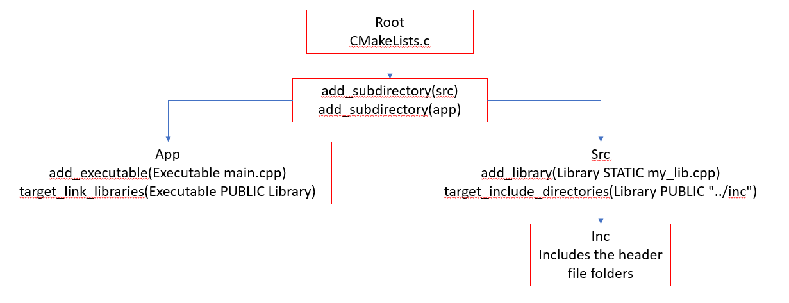

# Structuring Project
    This will make the Executable file in the root/build/app and is executed form there
    1. Added 3 new folders namely app, src and inc.
       1. app contains the main.cpp and its individual CMakeLists.txt. This is the folder that will contain the Executable file to be run
          1. The CMakeLists.txt is as below
                
```cmake
add_executable(Executable main.cpp)
target_link_libraries(Executable PUBLIC Library)
```

           The first line add_executable(Executable main.cpp) utilizes the main.cpp as the main file and the .exe file is named Executable.
           The second line links the Library that utilizes the other files for the project
          2. main.cpp is the code to be executed.
       2. src contains the my_lib.cpp (other file needed for project) and its individual CMakeLists.txt
          1. The CMakeLists.txt is as follows
                
```cmake
add_library(Library STATIC my_lib.cpp)
target_include_directories(Library PUBLIC "../inc")
```

           The first line add_library(Library STATIC my_lib.cpp) gives the name as "Library" and the .cpp file to be utilized.
           The second line add the include file from the inc folder that holds the declaration of the functions in my_lib.cpp.
       3. inc folder just have the .hpp file for the my_lib.cpp containig function declarations.
    2. The root folder i.e. 3_IntermediateProject has its own CMakeLists.txt as follows
        
```cmake
cmake_minimum_required(VERSION 3.22)

project(
    ProjectTemplate
    VERSION 1.0.0
    LANGUAGES C CXX
    )

add_subdirectory(src)
add_subdirectory(app)
```

        The major change is adding the location of the other CMakeLists.txt files location by using the function add_subdirectory. The rest defines the normal things that are similar to the HelloWorld project.

The CMakeLists structure is as below


