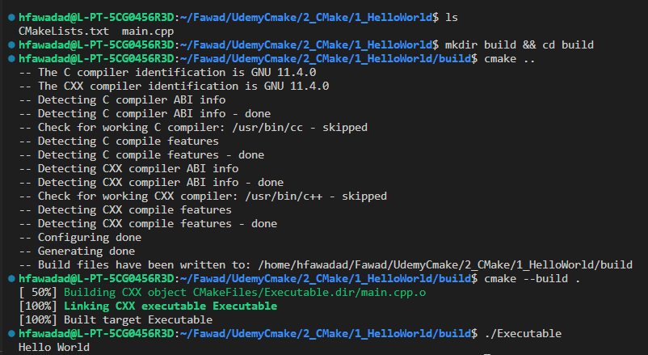
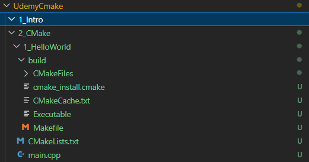

# CMake

1. Cmake is an a tool for build automation, testing, packaging and installation by using a compiler-independent method. It generates system's build files.
2. It supports a bunch of compilers like Clang, GNU GCC, MSVC and others.
3. Build Process with CMake is a two stage process.
   1. It first build files (scripts) from configuration file a.k.a CMakeLists.txt written in CMake langugae. 
   2. Then native tool chains are invoked either manually or cmake --build for building the targets. Here user defines the tool chain to be utilized.

## Basic CMake file Struture

   1. Make a txt file CMakeLists.txt in the root folder -> Make sure the lettering of the name follows this format i.e. C and M and L are Capital.
   2. Define the minimum CMake version by the following command
      1. cmake_minimum_required(VERSION 3.22) -> Set minimum required version for building projects. Can be older or newer based on needs,
      2. project(project_name
                 VERSION 1.0.0
                 LANGUAGES C CXX)

        1. project is a command to 
            1. Set the name of the project, 
            2. Version of the project and 
            3. The languages to be used in the project

      3. add_executable(Executable main.cc) -> used to build the project and make an executable. 
        Can have multiple  source files. The code files need to mentioned. 
        "IMPORTANT" Our executable file will be named Executable as the same in the command.

   3. Compiling the CMake file there are two methods as below
        1. Using Command Terminal
           1. mkdir build,
           2. cd build
           3. cmake .. -> .. explains the location of the root folder that contains the CMakeLists.txt and this command generates the build files or configure the project i.e. setup versions and language setting and so on.
           4. cmake --build . -> Start the compilation process and to make the .exe file of the project.
           5. Run the executable file. ./Executable -> since CMakeLists.txt has this name.
           6. The commands and expected outputs and the files generated
            
            
        2. Extensions in VScode
            
